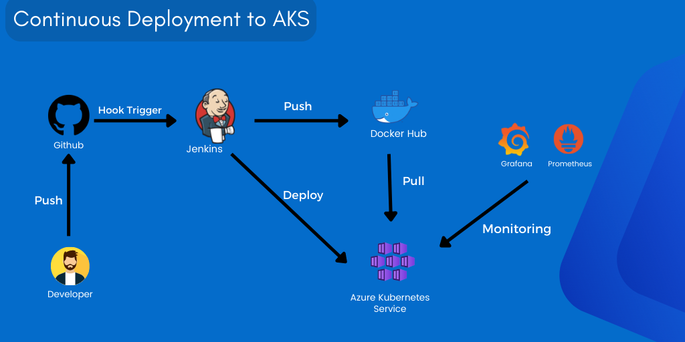
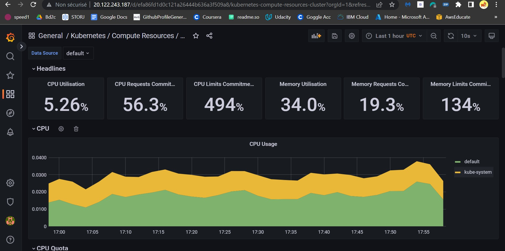
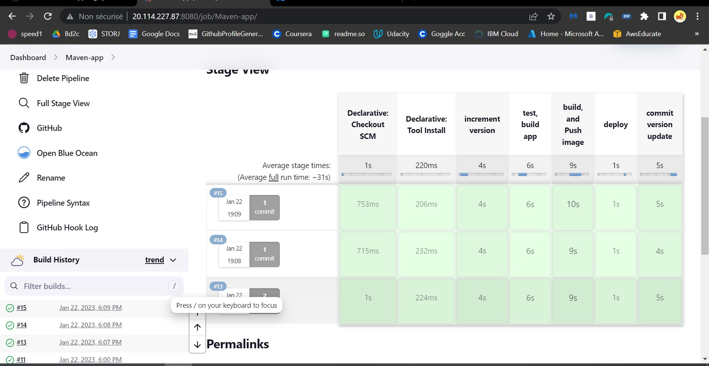
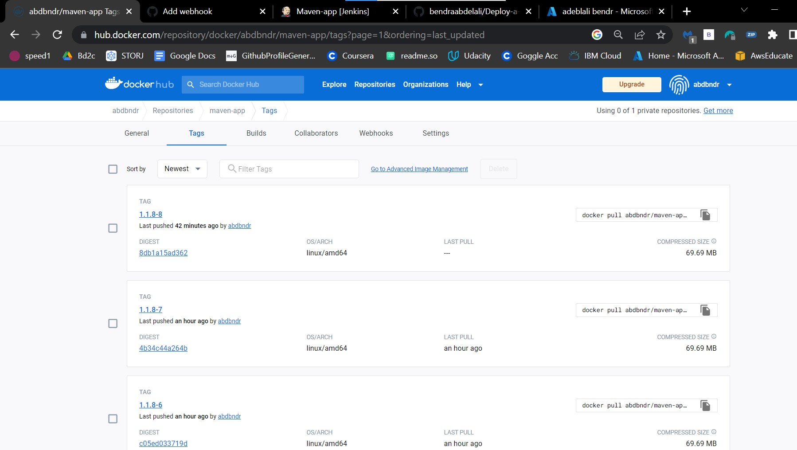

This project provides an automated and reliable way to deploy a Java application to Azure Kubernetes Service (AKS). It makes use of a combination of Terraform, Ansible, Jenkins, Prometheus, and Grafana to create a secure and efficient pipeline. The Jenkins server is created on an Azure Virtual Machine using Terraform and Ansible. The AKS cluster is created with Terraform, and Jenkins pipelines are used to build, test, and deploy the application. Prometheus and Grafana are used for monitoring and analyzing the performance of the application. This project provides a reliable and automated way to deploy the application to the AKS cluster.

<br>

<p align="center">
  
</p>

##  Prerequisites

To run this project, you will need to install 

- [`Azure Account`](https://azure.microsoft.com/en-us/free/?WT.mc_id=A261C142F) 
- [`Ansible`](https://docs.ansible.com/ansible/latest/installation_guide/intro_installation.html)
- [`Azure Cli`](https://learn.microsoft.com/en-us/cli/azure/install-azure-cli)
- [`Terrafrom`](https://developer.hashicorp.com/terraform/tutorials/aws-get-started/install-cli)
- [`Kubectl`](https://kubernetes.io/docs/tasks/tools/)
- [`Docker Hub Account `](https://hub.docker.com/)


## Usage
### 1- Create a Kubernetes cluster with Terraform 
 ```bash
  cd k8sDeployment
  az login
  terraform init
  Terraform apply 
```
Verify the health of the cluster
 ```bash
  kubectl get nodes
  kubect get pods 
  kubectl get all -n monitoring
```

### 2- Create Jenkins Server 
 ```bash
  cd ../JenkinsDeployment/DeployVM
  terraform init
  Terraform apply 
```
- Notice : you will the public ip as output 

### 3- Configure Jenkins Server  Using Ansible 
- pass the public ip into Ansible/hosts file

 ```bash
  cd ../Ansible
  ansible-playbook  Deploy_Jenkins.yml
``` 

#### Acces Grafana 

 ```bash
   kubectl get svc prometheus-grafana -n monitoring
```
- copy the  external ip and past it into browser  to use grafana Dashboard
- user:admin password: admin

- 

### 4- Acces Jenkins and Run  the pipeline
- pass the public_ip:8080 into your browser 
- - Notice that the password will appear when executing step 3 of Jenkins configuration using Ansible.
- After configuring Jenkins, adding credentials, and installing some helpful plugins, you should be able to execute Jenkins pipelines provided in the Jenkins file.

- 

#### -5- check if new Images   is pushed  to  Docker Hub
 - 


## Built With
- Jenkins
- Terrafrom
- Ansible 
- Kubernetes
- Azure
- Docker
- Grafana
- Prometheus
- Maven


## Authors
Bendra Abdelali
- [Profile](https://github.com/bendraabdelali)
- [Linkedin](https://www.linkedin.com/in/abdelali-bendra-934755182/)
- [Kaggle](https://www.kaggle.com/bendraabdelali)
